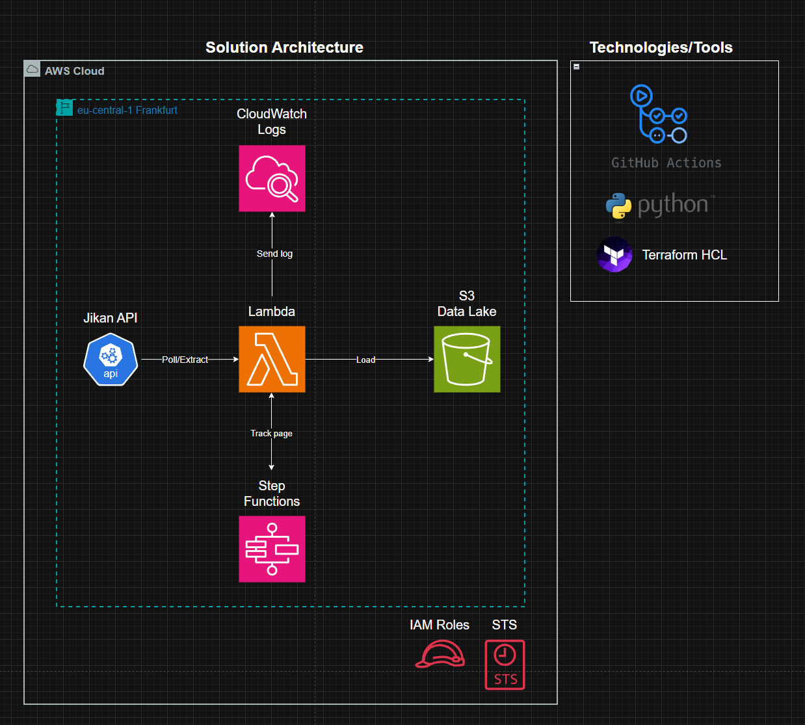

</br>

# Anime Analytics

## This is a data pipeline for extracting, and doing some light data manipulation, then loading it to a data lake.
This project is an automated data pipeline that will take semi-structured data from an API called jikan, and extract and load it into a data lake in the AWS Cloud (Amazon S3), then transform it using pandas and load it to snowflake for analytics

</br>

#### OBS!!! 
For this project I have leveraged AWS Cloud where I host my infrastructure so if you want to follow along you will need to create an AWS Account with an user that has programmatic access and can manage the console.


</br>

### Table of Contents
1. [Project Description](#project-description)
2. [Technologies Used](#technologies-used)
3. [Installation](#installation)
4. [Solution Architecture](#solution-architecture)
5. [Contact](#contact)


</br>

## Project Description

### Baseline of Use Case
The use case for this project was to extract data from Jikan API at [jikan.moe](https://jikan.moe/) and make some light data manipulation using [pandas library](https://pandas.pydata.org/docs/) which was executed in [AWS Lambda](https://aws.amazon.com/lambda/), then load the dataframe into [Amazon S3](https://aws.amazon.com/s3/) as a data lake in form of csv. </br>

#### Challenges & Solutions
The Jikan API, documented as such:

| Duration   | Requests  |
|------------|-----------|
| Daily      |**Unlimited**|
| Per Minute |60 requests|
| Per Seconds|3 requests |
|                        |

Although after some local testing of the api in a for loop the API only provided a response when it was called with a minimum of 2 seconds interwall. Therefor my solution for this issue was to run a state machine in AWS called [AWS Step Functions](https://aws.amazon.com/step-functions/) to keep track of each pagination for each API call to this Endpoint:
```sh
https://api.jikan.moe/v4/anime?page={integer-placeholder}
```
This is important for the pipline to keep of the page integer. </br>
My application/script/transform_anime_data.py returns and fetches the page integer that is stored in the state machine.

#### Terraform Modules
When working with directories in python, it is very easy to import files from child or parent directories. That is not the case when working with Terraform. </br>
First of all Terraform is not a programming language, it is a declarative configuration lanuage (HCL), and it is very strict and structured in how modules and directories are handled.
You cannot refer to child directories as you would with python directories, it is a little more complicated. </br>
In terraform you must create a module and a relative source path to where you'd want to pass values to (basically to which directory). </br></br>
**Example:**

```txt
anime-analytics/
├── infrastructure/
│   ├── lambda_extract.tf
│   └── iam/
│       ├── variable.tf
│       └── lambda_execution_role.tf
├── dev_requirements.txt
└── README.md
```

Here, the module with source is in the lambda_extract.tf and the value are passed into the module, then caught in the variable.tf file in the ./iam cild-directory. </br>
*be aware that the name you pass in the module snippit in the parent directory needs to be replicated in the child directory's variable.tf file and no default value should be assigned manually because it is passed in the module*


</br>
</br>

## Technologies Used
- Terrafrom HCL `(version: 1.9.5)`
- Python        `(version: 3.13.2)`
- AWS CLI       `(version: 2.24.20)`
- Git           `(version: 2.48.1)` *make sure to create an ssh-key in order to be able to clone the repository securely via the shell*
- CI/CD pipeline *i chose GitHub Actions but there are so many more, the only important part is to really understand the operating system of choice*

</br>
</br>

## Installation
After competing step 1 and you have made sure to have installed those technologies proceed to:
1. clone the repository:
*with this command*
```sh
git clone git@github.com:Lamo2real/anime_analytics.git
```
2. install the libraries and SDK:
*with this command from the root directory in the cloned project*
```sh
pip install -r dev_requirements.txt
```

</br>
</br>

## Solution Architecture

*this is the solution architecture for the automation of the data extraction pipeline*

</br>
</br>

## Contact
For questions about the project, feel free to contact me on **lamochi02@gmail.com**.
